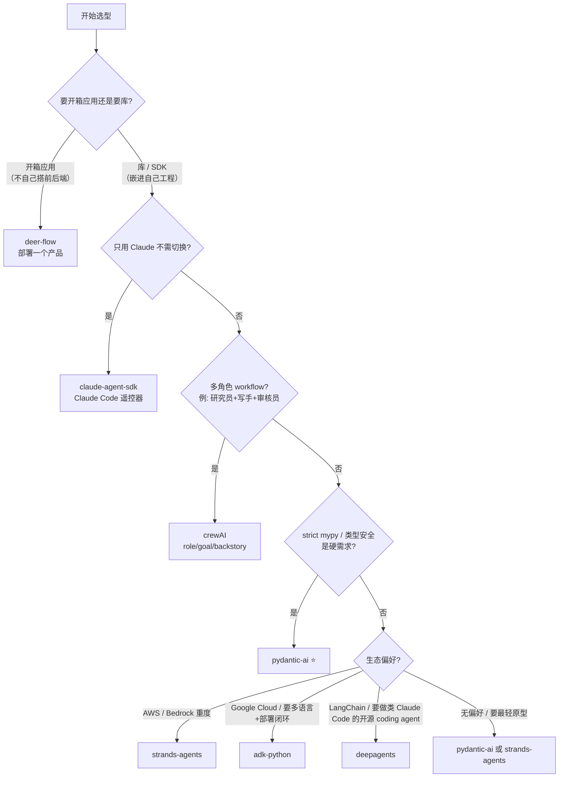

# 选型笔记 | 7 个主流 Agent SDK 跑完一轮后，我画了一张决策树

> 2026-04 | 用同一个 Bedrock Claude Sonnet 4.5 作基准，在 Python 端把 7 家主流 Agent SDK / 框架各自跑了一遍 hello world + demo，整理成一张矩阵、一张决策树、一份反决策表。

## 起因

最近团队要给一个新项目挑 Agent SDK，开了个会列候选。列完一看 15 家，每家 README 都写着"最轻量""最生产""最企业级"，对比表越看越糊涂。有人甩了张 GitHub stars 排行榜，说"那就按 stars 选吧"——排第一的 DeerFlow 62.9K，比排在中段的 pydantic-ai 16.5K 高出四倍。

问题是，这俩根本不是一类东西。DeerFlow 是一个能跑起来就用的应用（前端+后端+沙箱都打包好），pydantic-ai 是一个需要你自己写业务代码去 `import` 的 Python 库。应用类项目的 stars 天然比框架高 2-5 倍，因为能直接 `make dev` 跑起来看见效果的人远远多于愿意读文档写 `Agent(...)` 的人。拿这两个数字并排比，就像拿"VS Code 的用户数"去对比"TypeScript 编译器的用户数"。

所以我把这 7 家（claude-agent-sdk、strands-agents、deepagents、crewAI、adk-python、deer-flow、pydantic-ai）挨个跑了一遍最小可跑 demo，写了 7 篇独立学习笔记，这篇是把它们熬成一锅的总结。下面每一条结论都有对应 demo 的实测，不是 README 转述。

## 三条结论，看一眼就能带走

**第一条：先选你要绑的宿主生态，再选 SDK。** 这 7 家没有一家是真正中立的——claude-agent-sdk 绑 Claude Code CLI、strands-agents 偏 AWS Bedrock、deepagents 建在 LangGraph 之上、crewAI 有自己的 AMP 控制面、adk-python 通向 Google Cloud / Vertex、DeerFlow 底座也是 LangGraph、pydantic-ai 偏 FastAPI + Logfire。SDK 层的代码风格差异一周能学完，生态一旦绑死两年搬家不动。与其纠结"哪家 API 设计最优雅"，不如先回答"我团队未来一年主力云是 AWS 还是 GCP，主力 observability 是 Logfire 还是 LangSmith"。

再往深一层——"生态锁"听起来抽象，真跑起来是什么体验？举个具体例子：strands-agents 默认用 AWS Bedrock，你把代码挪到一个没配 AWS 凭证的环境跑，连 `Agent(model="...")` 都构造不出来，直接 `NoCredentialsError`。想换成 OpenAI？代码层一行 `model="openai.gpt-4o"` 确实够了，但 `pip install strands-agents` 默认没带 openai 依赖，你得手动装 `strands-agents-models-openai`；pricing / retry policy / token 统计这些原本和 Bedrock 绑定的特性全部换一套代码路径。再比如 deepagents，它把 `state` 作为中心枢纽贯穿整个 StateGraph，你要调试一个"为什么某个 middleware 没跑"，最顺手的工具是 LangSmith 那套 trace UI——换成自己搭 OTel + Grafana 能不能看？能，但 message 结构是 LangChain 的 `BaseMessage`，自己解析要花半天。这种**生态绑定不写在 API 签名里**，要真跑起来才能感觉到摩擦。

**第二条：stars 跟 SDK 质量几乎没关系，因为半数不是 SDK。** DeerFlow 62.9K stars 里至少一半是来自"想要一个开源版 Claude Code 直接部署"的非开发者用户；pydantic-ai 16.5K stars 里基本都是"写 FastAPI / Pydantic 的 Python 后端"。这是两种完全不同人群留的 star。真要横比质量，得先把 DeerFlow 和 claude-agent-sdk 这两个"非通用 SDK"单独拎出来——前者是应用，后者是 Claude Code 的 Python 遥控器。剩下 5 家才是同一条赛道上的 SDK。

**第三条：协议这一层，美国派和中国派走了两条路。** Strands / crewAI / ADK / pydantic-ai 四家美国派在 OTel + MCP + A2A 这三条协议上已经形成共识——原生支持、文档都写得清楚。字节的 DeerFlow 走的是另一条路：把整套应用打包（21 个 Skill + 5 个 IM 渠道 + 前后端沙箱），解决"一个团队没做过 agent，今天就想上线一个 Deep Research"的场景，协议层借用 LangGraph + MCP，但主要投入放在产品闭环而不是协议标准。这两条路都合理，但选型时要先想清楚自己是要"拼协议兼容"还是要"拼落地速度"。

顺带一条，不算主结论：这一轮跑下来最被低估的是 pydantic-ai。它是唯一一家 `mypy --strict` 默认 0 error 的，10 行代码跑完 hello world，还能直接把 LLM 输出当 Pydantic 模型用。只有 16.5K stars 不是它不好，是它没有云厂商站台。

## 7 个项目速览

| 项目 | 定位 | Stars | License | 最记忆点 |
|---|---|---|---|---|
| [claude-agent-sdk](https://github.com/anthropics/claude-agent-sdk-python) | Claude Code CLI 的 Python 壳 | 6.4K | MIT | 不是通用 agent 框架，是 Claude Code 的遥控器 |
| [strands-agents](https://github.com/strands-agents/sdk-python) | 多模型 event-loop 轻量框架 | 5.67K | Apache-2.0 | 13 家 provider 原生，Bedrock 头等 |
| [deepagents](https://github.com/langchain-ai/deepagents) | LangGraph 上的通用 agent 模板 | 21.3K | MIT | 对标开源版 Claude Code + ACP server |
| [crewAI](https://github.com/crewAIInc/crewAI) | role-based 多 agent 编排 | 49.3K | MIT | 唯一同时做开源 + SaaS（AMP）的独立商业公司 |
| [adk-python](https://github.com/google/adk-python) | Google 官方 agent 开发工具包 | 19.1K | Apache-2.0 | 多语言（Py/Java/Go）+ 一键 Cloud Run 部署 |
| [deer-flow](https://github.com/bytedance/deer-flow) | **应用 / harness（开源版 Claude Code）** | 62.9K | MIT | 21 个内置 Skill + 5 个 IM 渠道，部署级产品 |
| [pydantic-ai](https://github.com/pydantic/pydantic-ai) | FastAPI feel for GenAI + 强类型 | 16.5K | MIT | 唯一 `mypy --strict` 默认过的那家 |

**每家独立笔记**（各自的踩坑 / 架构细节 / 源码分析）收在 engineering-field-notes 的 `docs/ai-agents/` 目录下，对应同名 markdown（`claude-agent-sdk-python.md` / `strands-agents-sdk-python.md` / `deepagents.md` / `crewai.md` / `adk-python.md` / `deer-flow.md` / `pydantic-ai.md`）。

特别说一下 DeerFlow。它是这轮里唯一一家**不是 SDK**的项目，本质是 super agent harness——你不能 `import deerflow` 当库调，它是一个 `git clone && make dev` 跑起来的完整产品。你要么把它当"开源版 Claude Code"部署到自己服务器上直接用，要么把它当"参考架构"读源码抄思路，但不要试图把它当 pydantic-ai 那样的库嵌进你自己的 Python 工程——这是架构层的本质差异，62.9K stars 也改变不了。

## Hello World：一眼看出风格差

7 段代码全贴没必要，这里挑 3 个最极端的对比。统一任务：**写一个能回答城市天气的 agent，接受城市名，返回温度和描述**。

**最短的 claude-agent-sdk（18 行，但这里面一半是 MCP server 定义的仪式感）：**

```python
from claude_agent_sdk import ClaudeAgentOptions, ClaudeSDKClient, create_sdk_mcp_server, tool

@tool("weather", "查询城市天气", {"city": str})
async def get_weather(args):
    data = {"广州": "25°C, 多云", "北京": "12°C, 晴"}
    return {"content": [{"type": "text", "text": data.get(args["city"], "无数据")}]}

async def main():
    server = create_sdk_mcp_server(name="weather-demo", tools=[get_weather])
    options = ClaudeAgentOptions(mcp_servers={"weather": server},
                                 allowed_tools=["mcp__weather__weather"])
    async with ClaudeSDKClient(options=options) as c:
        await c.query("广州的天气？")
        async for _ in c.receive_response(): ...
```

注意那个强制的 `mcp__weather__weather` 命名格式——这不是 bug，是 claude-agent-sdk 的哲学：**所有工具都必须走 MCP 协议暴露**，没有传统的"装饰器即工具"捷径。你写完这段代码会意识到它压根不是给你"手写 agent 逻辑"用的，它是给你"把已有 Python 函数暴露给 Claude Code 子进程调用"用的。

**最长的 crewAI（14 行骨架 + role/goal/backstory 三件套）：**

```python
from crewai import Agent, Task, Crew, LLM
from crewai.tools import tool

llm = LLM(model="bedrock/global.anthropic.claude-sonnet-4-5-20250929-v1:0")

@tool("get_weather")
def get_weather(city: str) -> str:
    """查询城市天气。"""
    return {"广州": "25°C 多云", "北京": "12°C 晴"}.get(city, "无数据")

reporter = Agent(role="Weather Reporter", goal="告诉用户某城市天气",
                 backstory="你是气象专家。", llm=llm, tools=[get_weather])
task = Task(description="用户问：广州的天气？", expected_output="温度+描述", agent=reporter)
result = Crew(agents=[reporter], tasks=[task]).kickoff()
```

为什么 crewAI 连个 hello world 都要写成这样？因为它的建模假设是"你在组一个剧组"——必须有角色设定、有任务描述、有团队编排。对单 agent 简单查询这种场景，这套仪式感纯属浪费；但对"研究员 + 写手 + 审核员 + 发布员"这种多角色 workflow，这套建模反而比手写 graph 直观。**场景对了才划算，场景错了就是过度设计**。

**唯一 type-safe 的 pydantic-ai（10 行，LLM 输出直接当强类型数据用）：**

```python
from pydantic import BaseModel
from pydantic_ai import Agent
from pydantic_ai.models.bedrock import BedrockConverseModel

class Weather(BaseModel):
    city: str
    temp_c: float
    condition: str

model = BedrockConverseModel("global.anthropic.claude-sonnet-4-5-20250929-v1:0")
agent = Agent(model, output_type=Weather, instructions="你是天气机器人。")
result = agent.run_sync("广州的天气？")
print(result.output.city, result.output.temp_c, result.output.condition)
```

最后一行那个 `result.output.city` 是真的有类型——IDE 补全、mypy 检查、Pydantic 运行时校验三层都生效。我在这 7 家里跑了一圈 `mypy --strict hello.py`，**只有 pydantic-ai 默认 0 error**。claude-agent-sdk / deepagents / crewAI 全部有类型擦除（dict 进 dict 出），strands / adk-python 部分过（tool 签名能推但 agent result 还是动态）。

**行数最少不等于最好**——strands-agents 能压到 7 行，但前提是你已经配好 AWS_PROFILE + region + Bedrock 权限 + `us-west-2` 默认区；pydantic-ai 的 10 行里包含了显式 model 构造、BaseModel 定义、output_type 声明，换来的是强类型 + 任意 provider 切换 + 明确的错误路径。**"性价比最高的 10 行"这个说法不夸张**。

为什么同样是"跑一个天气 agent"，行数能从 7 行跳到 23 行？答案不在"代码写得多啰嗦"，而在"SDK 假设你需要先搭多少脚手架"。strands-agents 的 7 行假设你已经在 AWS 里，tool 装饰器 + `Agent(tools=[...])` 一调用，event loop / retry / telemetry 全内置；adk-python 的 23 行是它逼着你把 `Session` + `Runner` + `InvocationContext` 这三层先建起来——这在 demo 阶段纯属累赘，但在生产阶段反而是资产（多用户多会话 / 可恢复 / 可审计这些都是天然的）。crewAI 的 14 行里最贵的是 `role="Weather Reporter" + goal="..." + backstory="你是气象专家"` 这三行，它们在单 agent 场景下确实是废话，但在"研究员把发现传给写手、写手把稿子传给审核员"的多 agent 场景，这三行就是 agent 的"人设"——LLM prompt 里会被注入进去，决定了 agent 怎么互相协作。**框架不是越薄越好，是"假设"越贴合你的场景越好**。

## 评测矩阵（10 维精简版）

（完整 40+ 维矩阵见素材文件。下面这张是浓缩版。）

| 维度 | claude-agent-sdk | strands-agents | deepagents | crewAI | adk-python | deer-flow | pydantic-ai |
|---|---|---|---|---|---|---|---|
| **本质** | SDK（Claude Code 壳） | SDK（轻框架） | SDK（LangGraph 中间件） | SDK + CLI + SaaS | SDK + CLI + Web UI + 部署 | **应用 / harness（非 SDK 库）** | SDK（纯库） |
| **agent loop 在哪** | Claude Code 子进程内 | SDK 内 `event_loop_cycle` | LangGraph StateGraph | SDK 内 `CrewAgentExecutor` | 有序 processor pipeline | `create_agent` + 17 中间件 | `_agent_graph.py` FSM |
| **核心抽象** | `query()` | `Agent(model, tools)` | `create_deep_agent()` | `Agent + Task + Crew` + `Flow` | `LlmAgent + Seq/Par/Loop + Runner` | `lead_agent` + `task` tool | `Agent[DepsT, OutputT]` |
| **多 agent 模式** | CLI 层 markdown 声明 | graph / swarm / A2A / tool | SubAgentMiddleware | sequential / hierarchical + Flow | 5 种正交组合 | `task` 派 sub-agent | pydantic-graph FSM |
| **Hello World 行数** | 18 | **7** | 8 | 14 | 23 | N/A（跑应用） | **10** |
| **原生 type-safe** | ❌ | ⚠️ 部分 | ❌ | ❌ | ⚠️ 部分 | N/A | **✅ strict mypy 过** |
| **原生 provider 数** | 1 | 13 | 依赖 LangChain | 6 | 4 + LiteLLM | 可配多家 | **22+** |
| **可观测** | CLI transcript + W3C trace | **OTel 原生** | LangSmith | OTel + AMP | OTel + GCP + Web UI | LangSmith + Langfuse | **Logfire + OTEL 内置** |
| **部署工具链** | pip 即用 | AgentCore | 无 | AMP Control Plane | **`adk deploy cloud_run / agent_engine`** | Docker Compose + K8s | `agent.to_a2a()` |
| **MCP / A2A** | MCP | A2A server | ACP server + A2A | A2A + MCP client | **A2A 双向** | MCP | A2A + MCP |

几个值得拎出来的横切观察：

1. **MCP 基本已成标配**（6/7 家，DeerFlow 也有 mcp/ 目录），A2A 协议正在美国派 4 家里快速普及。ACP 协议目前只有 deepagents 在主动推，方向是"让 AI IDE 反过来连 agent"。
2. **只有 ADK 和 DeerFlow 自带 Web UI**，其他家要可视化调试得上付费可观测平台（LangSmith / Logfire / AMP）。
3. **agent loop 写在哪，决定了 SDK 的厚薄**。claude-agent-sdk 把 loop 甩给子进程所以它最薄；ADK 把 loop 写成有序 processor pipeline 所以它最工程化；pydantic-ai 把 loop 编译成一个 FSM graph，代价是上手要懂一点 `pydantic-graph`。

## 选型决策树



**这棵树最重要的是 Q1 这一步**：先问"你要的是一个成品应用还是一个 Python 库"。这一步分叉决定了后面所有对比都有意义——如果你想要的是"今天就部署一个能用的 Deep Research 产品"，那 DeerFlow 是最优解，跟后面 6 家 SDK 没有可比性；如果你想要的是"在我的服务 / CI / 工具链里嵌入 agent 能力"，DeerFlow 就从候选里直接删掉。

**部署一个应用 vs `import` 一个库**——这是整篇文章最值钱的一句话。看到 62.9K stars 就跑去调研 DeerFlow 的 API 的工程师，我见过好几个，最后都得退回来重新选。

## 模型切换成本：代码一行，整个栈全换

挑完 SDK，下一个问题常常是"未来要不要换 LLM 提供商"。我跑 demo 时刻意测了一遍"同一个 agent 从 Claude 换成 GPT-4o"的改动量，结果比想象中大。

表面看 7 家 SDK 都支持多 provider，代码改动都是"一行参数"级别的：`model="openai.gpt-4o"` 或者 `LiteLlm("bedrock/...")` 之类。但真正的切换成本藏在三个地方：**第一是 tool schema 格式**——Anthropic 和 OpenAI 在 function call 的 schema 严格度、对 `additionalProperties` 的处理、`oneOf` 支持上都有细微差异，tool 函数的 docstring 和 type hint 在两家的表现不一定一样；**第二是 system prompt 的模板**——claude-agent-sdk 直接把 system prompt 塞给 Claude Code CLI，换 OpenAI 等于放弃整个 Claude Code subagent 生态；**第三是 structured output 的底层机制**——Claude 靠 tool use + 解析，OpenAI 靠 JSON mode，Gemini 靠 function declaration，不同 provider 在 pydantic-ai 这种原生强类型栈里体验差异最小，在 strands / crewAI 里偶尔要踩 edge case。结论是：**强类型 SDK（pydantic-ai）在多 provider 切换上付出的代价最小**，弱类型 SDK 遇到切换就要重新测一轮端到端。

## 反决策表：什么时候别选它

每家都有自己最擅长的场景，也都有"根本不合适"的场景。下面这张表是选错代价最大的几条红线——比起"什么时候该选谁"，"什么时候别选谁"往往更值钱，因为排除一个不合适的选项能省掉几周 PoC 时间。

| 项目 | **不要**选它的那一条 |
|---|---|
| claude-agent-sdk | 你不想死绑 Anthropic，或者将来可能要切 Bedrock / OpenAI / Gemini——它根本不是通用 agent 框架，是 Claude Code CLI 的 Python 遥控器。 |
| strands-agents | 你不在 AWS 生态，又嫌 `AWS_PROFILE + region + boto3 + us-west-2 默认` 这套初始化门槛烦——默认 provider 开不起来 `Agent()` 直接报错。 |
| deepagents | 你反感 LangChain / LangGraph 世界观（state 是 dict、messages 是 `BaseMessage`、可观测靠 LangSmith）——它的全部设计都建立在 LangGraph 之上，绕不开。 |
| crewAI | 你的场景只有"单 agent + 几个工具 + 一问一答"——role/goal/backstory + Task + Crew 四层声明在简单场景纯浪费（demo 最少也要 14 行骨架）。另外它的 `hierarchical` 多 agent 模式用 manager agent 调度 sub-agent，**实测比 sequential 模式贵 30 倍**（1,288 vs 38,337 tokens 跑同一个任务），生产环境踩一次就炸账单。 |
| adk-python | 你在做快速原型 / 不吃 Google 生态 / 嫌 `pip install` 拉 200MB+ google-cloud 全家桶把 Docker 镜像撑到 500MB——工程化最彻底的代价是上手门槛最高。 |
| deer-flow | 你要把 agent **作为库 `import` 进自己工程**而不是"部署一个应用"——它是 62.9K stars 的开源应用（前端+后端+沙箱+Docker Compose），不是 SDK。62.9K 这个数字反映的是"愿意部署应用的人多"，不反映"它是更好的框架"。 |
| pydantic-ai | 你的项目没用 Pydantic v2（重度依赖 `msgspec` / `attrs` / `marshmallow` 等其他数据库）——`output_type=` 只吃 Pydantic 模型，强绑 Pydantic v2 API 是它的哲学底线。 |

## 踩坑速查

上面 crewAI 那条"hierarchical 贵 30 倍"值得单拎出来说一下。demo 我是这么跑的：同一个"研究某主题写一份报告"的任务，分别用 `Process.sequential` 和 `Process.hierarchical` 两种模式跑。sequential 模式下 Crew 按顺序执行 Task，总 token 1,288；hierarchical 模式下 manager agent 要先决定"派哪个 agent 做什么"，每次决策都要把所有 agent 的 role / goal / backstory 重复塞进 context，跑完 38,337 tokens。**30 倍差价**不是我算错了，是 manager 模式本身的元开销——多 agent 协作场景用得好是利器，用错场景就是烧钱机器。生产环境上 hierarchical 前，务必先跑个小 demo 看 token 数。

其他几家的 onboarding 坑零散记一下：

- **adk-python 的第一次 `pip install google-adk` 会拉 200MB+ 的 google-cloud-aiplatform 全家桶**，CI 首次构建要 3-5 分钟——做 Docker 镜像最好分两层，底层 base image 先 install 好 adk。
- **strands-agents 默认跑 `us-west-2` 的 Bedrock**，如果你的 Bedrock 配额在其他区会直接 403。第一次跑看 `Agent()` 报错不要以为是代码问题，先 `echo $AWS_REGION` 和 `aws sts get-caller-identity` 检查一遍。
- **pydantic-ai 的 `pip install` 默认装 `pydantic-ai` 全家桶**（拉所有 provider 的 SDK）。只用 Bedrock 的话装 `pydantic-ai-slim[bedrock,logfire]` 能省一半依赖。
- **DeerFlow 2.0（2026-02-28 ground-up 重写的版本）和 1.x（仍在 `main-1.x` 分支维护）差别不小**，2.0 是 LangGraph 底座重写 + Skill 系统重做。照着 1.x 教程跑 2.0 会各种对不上号，注意看 README 顶端的版本标识。

## 一句话收尾

挑 SDK 这事儿，花最多时间的不应该是"读 README 对比 API"，应该是"想清楚自己未来两年要绑的生态"。想明白这一层，7 家里有 5 家自己会从候选里消失；剩下 2 家跑个 hello world，选型就定了。

